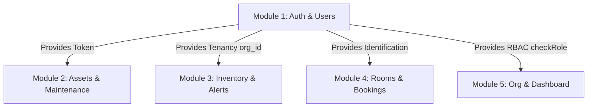

# StockNest — Module 1: Auth & Users (Detailed Technical Reference)

This document provides a comprehensive breakdown of **Module 1 (Auth & Users)** for the StockNest backend. It explains what was accomplished in Module 1, details the exact codebase files, explains the logic of the code, outlines its vital role and contributions to the whole project, and provides a clear Postman API testing guide.

---

## 🛠️ Section 1: Overview of Module 1 & What We Did

Module 1 is the **security and identity backbone** of the StockNest ecosystem. In this module, we built a fully secure, stateless authentication and user management system from scratch.

### Major Deliverables Completed
1. **Secure Database Schema**: Defined user roles (`Admin`, `Manager`, `Staff`), user entities, and organization relations using SQL.
2. **Password Cryptography**: Configured secure password hashing using `bcryptjs` so plaintext credentials are never stored in the database.
3. **Session Token Issuance**: Created a token generator using JSON Web Tokens (`jwt`) to establish temporary stateless sessions.
4. **Custom Authentication Interceptors**: Developed JWT decoding middleware (`authMiddleware`) to authenticate user sessions dynamically.
5. **Role-Based Access Control (RBAC)**: Developed routing filters (`checkRole`) to restrict API endpoints (e.g., only managers or admins can modify configuration settings).
6. **User Administration APIs**: Built listing and modification routes allowing administrators to manage team configurations and user profiles.

---

## 📂 Section 2: File Structure of Module 1

The following files in the backend repository implement the functionality of Module 1:

1. **Database Schema**: [`backend/sql/schema.sql`](file:///C:/Users/tanma/Desktop/StockNest/backend/sql/schema.sql)  
   *Defines the structure of the `users` and `organization` tables, index optimizations, and user role constraints.*
2. **JWT Configuration Utilities**: [`backend/src/config/jwt.js`](file:///C:/Users/tanma/Desktop/StockNest/backend/src/config/jwt.js)  
   *Acts as a central utility config file providing token-signing and decoding helpers.*
3. **Routing Endpoints**:
   - [`backend/src/routes/authRoutes.js`](file:///C:/Users/tanma/Desktop/StockNest/backend/src/routes/authRoutes.js) — *Maps entry points for user registration, logging in, and retrieving current profile.*
   - [`backend/src/routes/userRoutes.js`](file:///C:/Users/tanma/Desktop/StockNest/backend/src/routes/userRoutes.js) — *Exposes management tasks like fetching user lists and updating profile info.*
4. **Controllers (Business Logic)**: [`backend/src/controllers/authController.js`](file:///C:/Users/tanma/Desktop/StockNest/backend/src/controllers/authController.js)  
   *Contains the logical handlers for registering, checking credentials, reading profiles, fetching data, and writing database changes.*
5. **Custom Middlewares**: [`backend/src/middleware/authMiddleware.js`](file:///C:/Users/tanma/Desktop/StockNest/backend/src/middleware/authMiddleware.js)  
   *Contains interceptors that verify credentials and filter route access roles.*
6. **Main Server Registry**: [`backend/src/server.js`](file:///C:/Users/tanma/Desktop/StockNest/backend/src/server.js)  
   *Hooks the routers under the prefix namespaces `/api/auth` and `/api/users`.*

---

## 💻 Section 3: Technical Code Explanation

### 1. Custom Authentication Middleware (`authMiddleware`)
This function runs before protected routes. It reads the Authorization header, extracts the token, and verifies it.

```javascript
const authMiddleware = (req, res, next) => {
    // 1. Read 'Authorization: Bearer <token>' header
    const token = req.headers.authorization?.split(' ')[1];

    if (!token) {
        return res.status(401).json({ success: false, message: 'No token provided' });
    }

    // 2. Decode the token using our secret key
    const decoded = verifyToken(token);
    if (!decoded) {
        return res.status(401).json({ success: false, message: 'Invalid or expired token' });
    }

    // 3. Attach metadata to the request for subsequent middleware or controllers
    req.userId = decoded.user_id;
    req.userEmail = decoded.email;
    req.userRole = decoded.role;
    req.orgId = decoded.org_id;

    next(); // Pass command to next function in the chain
};
```

### 2. Role Verification Middleware (`checkRole`)
A higher-order function that verifies if the logged-in user possesses the required clearance levels.

```javascript
const checkRole = (...allowedRoles) => {
    return (req, res, next) => {
        // req.userRole was attached above by authMiddleware
        if (!allowedRoles.includes(req.userRole)) {
            return res.status(403).json({
                success: false,
                message: 'Access denied. Insufficient permissions'
            });
        }
        next(); // Authorization approved
    };
};
```

### 3. Retrieve All Users controller (`getUsers`)
Retrieves the list of active users in the caller's organization.

```javascript
const getUsers = async (req, res) => {
  try {
    // orgId is injected by authMiddleware to filter results
    const result = await pool.query(
      'SELECT user_id, org_id, email, name, role, last_login, created_at FROM users WHERE org_id = $1 ORDER BY user_id ASC',
      [req.orgId]
    );
    return res.status(200).json({ success: true, users: result.rows });
  } catch (err) {
    console.error('GetUsers error:', err.message);
    return res.status(500).json({ success: false, message: 'Server error retrieving users.' });
  }
};
```

---

## 🔌 Section 4: Contribution of Module 1 to the Entire Project

Module 1 is not a standalone feature; it acts as the foundation for the entire application.



### 1. Dynamic Tenant Isolation (`org_id`)
StockNest is built to support multiple organizations in a multi-tenant layout. When a user requests assets or rooms, the backend must return only their organization's data. 
Because **Module 1** extracts and attaches `req.orgId` directly from the user's token:
- Developers in other modules can simply run database queries using `WHERE org_id = req.orgId`.
- This ensures complete data separation without complex logic.

### 2. Unified Authorization Gateway (`checkRole`)
The security filter we wrote is used globally. For example:
- **Assets Module**: Restricts asset registration or decommissioning to admins.
- **Inventory Module**: Restricts adjustments to stock count to manager roles.
- **Room Booking Module**: Allows any role to view rooms, but restricts room closure to managers/admins.
This unified pattern simplifies code and prevents unauthorized actions.

---

## 🧪 Section 5: API Testing Guide using Postman

You can test these endpoints using **Postman** to verify authentication and permission handling.

### Postman Setup Steps
1. Create a **Postman Environment** containing:
   - `base_url` set to `http://localhost:5000`
   - `jwt_token` (empty placeholder)
2. In the `POST /api/auth/login` request, paste this script into the **Tests** tab to automatically save the token:
   ```javascript
   const response = pm.response.json();
   if (response.token) {
       pm.environment.set("jwt_token", response.token);
   }
   ```

---

### Request Details

#### 1. User Registration (`POST /api/auth/register`)
- **Url**: `{{base_url}}/api/auth/register`
- **Headers**: `Content-Type: application/json`
- **Body**:
  ```json
  {
    "name": "Jane Doe",
    "email": "jane.doe@stocknest.io",
    "password": "securepassword123",
    "role": "Admin",
    "org_id": 1
  }
  ```
- **Response**: `201 Created` with a new JWT token.

#### 2. User Login (`POST /api/auth/login`)
- **Url**: `{{base_url}}/api/auth/login`
- **Headers**: `Content-Type: application/json`
- **Body**:
  ```json
  {
    "email": "admin@stocknest.com",
    "password": "admin123"
  }
  ```
- **Response**: `200 OK` + JSON containing the token, which is saved as `jwt_token`.

#### 3. View Logged-in Profile (`GET /api/auth/me`)
- **Url**: `{{base_url}}/api/auth/me`
- **Headers**: 
  - `Authorization`: `Bearer {{jwt_token}}`
- **Response**: `200 OK` returning the user data matching the token.

#### 4. List Team Directory (`GET /api/users`)
- **Url**: `{{base_url}}/api/users`
- **Headers**:
  - `Authorization`: `Bearer {{jwt_token}}`
- **Verification scenarios**:
  - *Scenario A*: Login as **Admin** or **Manager** -> Send request -> `200 OK` with the list of users.
  - *Scenario B*: Login as **Staff** (e.g., `neha@stocknest.com` / `Neha123`) -> Send request -> `403 Forbidden` (`Access denied. Insufficient permissions`).

#### 5. Update Profile / Edit Role (`PUT /api/users/:id`)
- **Url**: `{{base_url}}/api/users/3` (replace 3 with target user ID)
- **Headers**:
  - `Authorization`: `Bearer {{jwt_token}}`
  - `Content-Type`: application/json`
- **Body**:
  ```json
  {
    "name": "Anshika Sehgal",
    "role": "Manager"
  }
  ```
- **Verification scenarios**:
  - *Scenario A*: Login as **Admin** -> Update details -> `200 OK` (role changes allowed).
  - *Scenario B*: Login as **Staff** -> Attempt to change role -> `403 Forbidden` (`Only Admins can change user roles`).
  - *Scenario C*: Login as **Staff** -> Attempt to update another user's profile -> `403 Forbidden` (`You can only update your own profile`).
